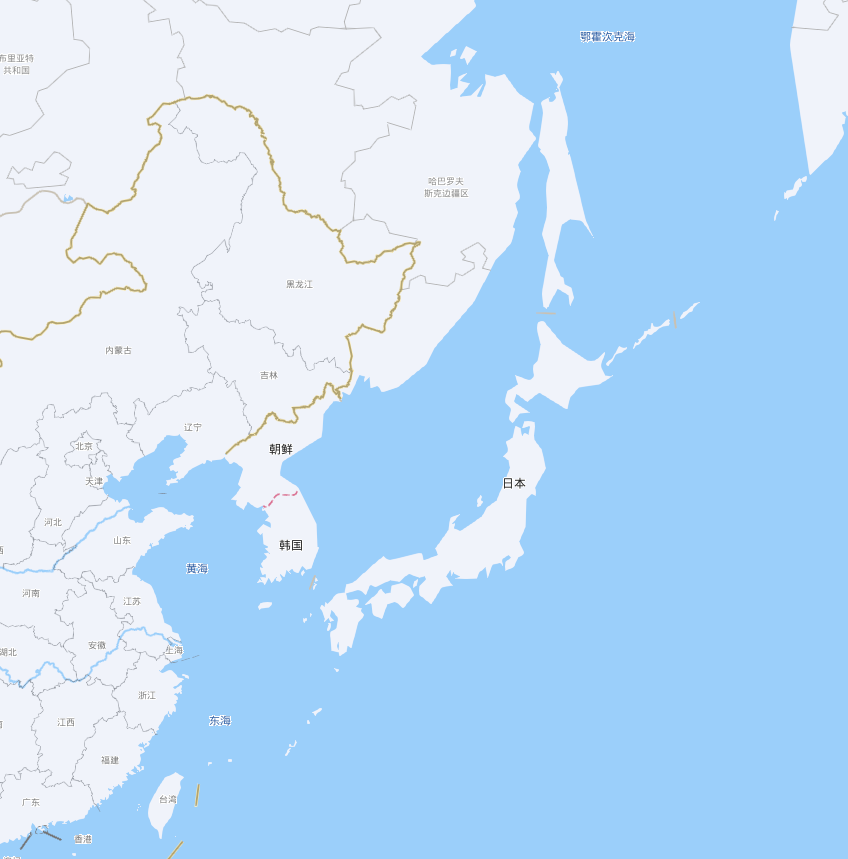
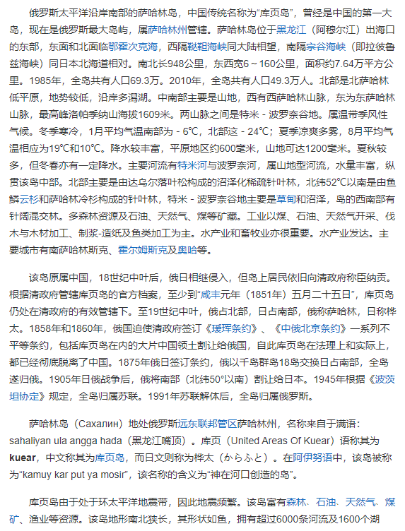
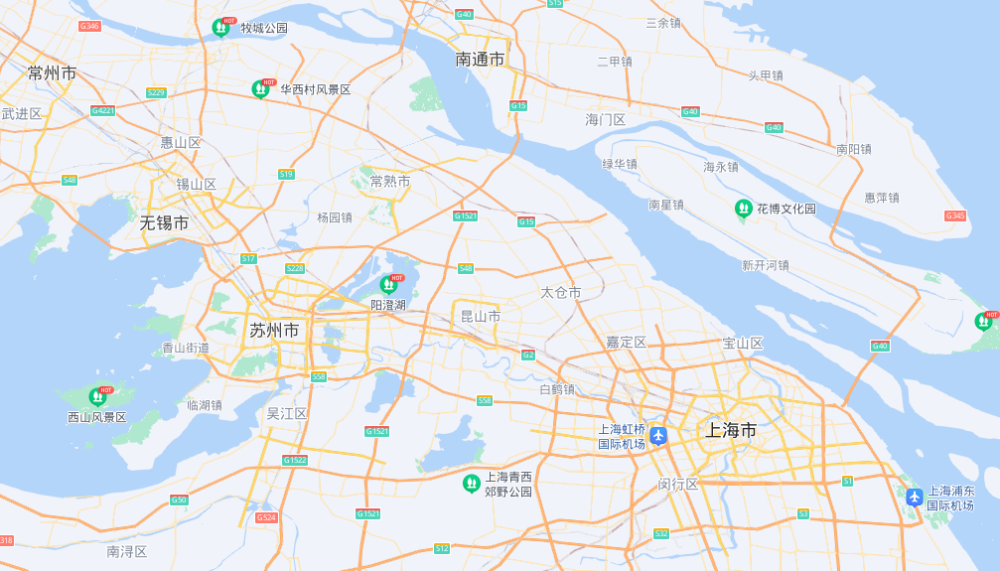
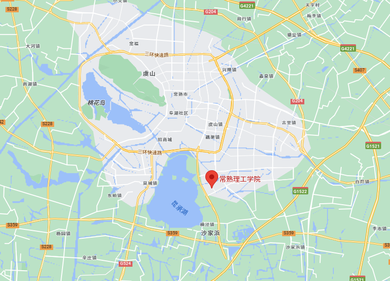

# 战术少女与相关理论-第一卷

## 1. 大纲

未来集团军的大部队不堪忍受CSA的袭扰,向着SH方向迁移

王冉所带的回收小队意外唤醒了冬眠的孩子们.准备带着孩子们去往大部队留下载具的地方,再向着SH的导轨中转站移动.

在中途被霜星的回收部队追上,原来秦兰一路上都在放置信标,这使得霜星来得比预想的快.

以孩子们为人质王冉小队得以撤离,孩子们回到了霜星的手中.坐着车来到了最近的情报站.

在经过直升机,运输机,直升机轮倒之后,抵达了位于库页岛的霜星总部.

## 2. 设定

### 2.1库页岛基地

#### 2.1.1 2067霜星

**部分时间线**

> 2058: 第一批维护人员苏醒,秦屏所在重大项目的相关人员紧接着苏醒?
>
> 2060:基地整备完成
>
> 2061:科研人员批次被唤醒 
>
> 2063:开始渗透GC,启动战前遍布亚欧大陆的情报站,主动接收NCHR
>
> 2064:CSA政变,CSA派隐秘上台

2067:

2064霜星政变已经发生,人们对三年前的时间闭口不言.

 

人们已经了解了bigcity与大陆基本情况,尚不了解bigcity具体高层结构与失格事件真相.

俄罗斯的老爷们们虽然是高级知识分子,但对bigcity与国家灭亡仍然颇有微词,他们其中一些认为,bigcity与联合政体不过是西方政治的产物,对俄罗斯这个长时间受到敌视的国家充满偏见,理由是俄罗斯国土面积巨大而已知的bigcity却只有4个,并且从收集的资料来看,俄罗斯的国民在核战后收到的保护与救援十分之少,他们呼救信号的优先度低到了可以视而不见的地步.

 

霜星军事行动进行了4年,需要维护常驻驻点与扩充,清剿周边威胁武装(难民,匪帮,流亡军人,不受控的nchr),其触角占满库页岛周边海域,鞑靼海,中国东北,长江三角洲地区,日本北海道地区,哈巴罗科夫(东北上)地区,莫斯科地区.恢复(重建)了上海分部(地下)于原”常熟华西风景区”附近,恢复了哈巴罗科夫地区的旧址,建立了大大小小的情报站与探索站.(采集原料与回收)

他们的行动与bigcity外幸存者,匪帮混在在一起,尚未引起过多关注.

​                               

由于2059应急研究合成淀粉,核聚变的便利,霜星重启了冬眠前的部分军事研发,并取得了关键成果.:动能电池小型化,常温超导(冬眠前已突破)导线集成与工业化生产,可搭载的高能激光武器模块-霜星,.超小型无人机集群-雏蜂.

正在研发的可穿戴动能电池及飞轮电池混合动力源推进服装包括:喷气滑板进阶_喷气推进肢,激光模块供能,(压缩气体)弹射,简单骨骼辅助.以该服装为基的新一代作战方式正在于基地内探索训练中.

 

从2058苏醒时陷入的危机时期末尾开始,至2064秦屏已经苏醒6年.冬眠前参与了集群无人机,作战服能源包部设计与量产研究,冬眠后继续参与了一年左右,其工作逐渐偏向研发下端及后续的工业化生产流程设计和产品的模块化改造,由此她对于霜星的新式武器有着更为深刻的了解与简介(产品经理是也!).2064年被委任于随军数据收集小组中,负责研发前后端的对接工作,结识了不少人脉并积累威望.由于2065后霜星军事活动的骤然增多,凭着对武器的了解,其军事指挥才能在一次次的危机中显露出来.次年,试任军事顾问.

 

很多像秦兰这种被冬眠于基地,而其父母已经开始工作的情况.霜星方面解释为保护孩童不受当前核冬天极端环境影响,但,也被视为是在苏醒危机中以此要挟工作人员以维持基地稳定的手段.2067年的意外苏醒抢救,宣告了这种手段的失败,随之是2067至2070年军事化培训的过度时期的措施,在情况允许之后(2070),霜星彻底放开了这种要挟.

 

其余设定请在写作过程中经过思考给出

####  2.1.2 基地布局:

[南萨哈林斯克市卫星地图 - 俄罗斯南萨哈林斯克市中文版地图浏览 - 南萨哈林斯克旅游地图 (meet99.com)](https://www.meet99.com/map-Yuzhno_Sakhalinsk.html)

L区:生活区 :

地下:人员宿舍,食堂,岩壁景窗,文娱综合体&礼堂,污水处理,发酵沼气罐,中央循环中心.

​           地上部分:伪装废墟,伪装天线,地面哨站,简易操场.(理论上来说地面已经是核冬废墟了)

W区:       

地下:办公&行政&数据处理,实验室,四级实验室,仓库,危险品仓库,并行计算机集群_算力服务(战前产品,共调用),数据处理中心_旧(战前产品,自然地下水水冷中),光子计算机_算力服务&AI系统总控(战前项目_战后完成,供调用),轻武器测试场,样品试制车间

​           地上:爆炸物测试场,环境观测站,小_天体观测站

P区:    

地下:配电站,供热集管,激光模块自动生产线,飞轮电池自动生产线,枪械配件自动生产线,自动制造生产线(万精油型),飞轮电池集中点.

​           地上: 核聚变发电站_半地上(已有蓝图,已有突破,醒后开建),潮汐能发电站,建筑材料仓库,海港,奥哈_火力发电站(旧,战前), 变电站(旧).奥哈_钢材

**库页岛世界位置**

**库页岛词条**

#### 2.1.3 组织:

部门:

行政部：

​       决策协调委员会

​       道德伦理审计委员会。（担任了类似法院的职能）

​       总裁办公室

​           审计部门

​           Csa指挥中心

​       人力资源部

​       行政管理部

​       基建部

​       培调部

​	   会计部：

​    管理会计部：

​    财务会计部：（下发的是由霜星公司发行的金券）

研发部：

设计院：

模块量产化攻关小组：

数据收集与改进中心（中试部）：

后勤：

​    研发生产原料管理

​    生活后勤服务部门：

​    生产部：

（csa）军事工作：

向外探索指挥部: 启动并维护预先建好的分布于亚洲大陆的信号基站与情报前哨站.建立新的信号基站与情报站

霜星情报研究局：配合向外探索指挥部,发展情报组织.

近卫安全保密工作组：

俄罗斯冬眠军安置处：

军工反馈组：

​    后世代军政体改革小组

​    试装武器数据收集小组。

### 2.2 秦兰信息:

#### 2.2.1 时间线:

2035,1111:出生

2040:哈巴罗科夫霜星前总部附属家属小学就读

2042:随霜星总部迁往库页岛,继续于附属小学就读(托管)

2043,0911:前往中国上海霜星分部进行冬眠适应性训练.

2043,1222:冬眠

2067,0911:提前唤醒 (原计划:2071,0624之前由霜星遥控唤醒);

 

### 2.3 秦屏信息:

#### 2.3.1 时间线:

北方人(北京) 单亲家庭,其母抚养大

2014年7月26日生,其父为在服役军官,在父亲的有意影响下通晓军事

2026年 因常年分别,父母离婚,其父不久与部队一文职人员相恋.其母争取到了秦屏抚养权. 

2031年 哈尔滨工业大学自动化专业,2034在校园结识苏州人(暂时没有名字) 

2035被招入国防科技大学自动化生产实验室,由于迷糊,同年发现怀孕已经怀孕3月,其时已前往湖南长沙市(国科大),

2035年11月11日 (二十一岁)怀胎8月生下秦兰,父母陪伴3月后再次分开,秦兰留在了母亲身边.交由相关部门统一托管.父亲由于

“真是,又是这种情况”

2040,携秦兰赴任哈巴罗科夫,秦兰学习俄语,2042年初,迁至库页岛.

2043年末,处于对世界安全形式得判断,秦兰再次被送往中国上海霜星分部进行冬眠,

**上海分部位置:** 常熟风景区,东南方向,昆承湖附近.

#### 2.3.2 相关角色:

**第一卷部分角色：**

**顾问组组长：**

数据收集小组同事

秦兰朋友：

集群无人机设计组时期同事(冬眠前):莉莉娅. 其子: 萨沙。

同事(冬眠前):布柳赫尔. 其女:莎蒂

秦屏所处团队:

组长:

随军数据收集小组,秦屏助理:

邻居,同一小组同事:

上司:

克拉克.里根(英国人)

### 2.4无格者

一开始就被排除在bigcity之外的幸存者。他们艰难的在野外生存着。

### 2.5 NCHR

national cavalrymen hibernation reservist: 民族冬眠预备机械部队.

#### 2.5.1 CCHR:

China cavalrymen hibernation reservist. 中国的冬眠预备机械化部队. 

中国官方命名为**未来集团军**.(WLJT)

**番号**:84军

**时间线**:

> 2063:李元四所属84军于桃花岛冬眠基地苏醒 , 5天后630所宝山区地下实验室被唤醒.
>
> 2064:第一次向GCSH试探接触.位于SH附近的新630所实验室开建,84军地上营地开建.
>
> 2065:冬眠基地与CSA发生遭遇战,双方发生接触.CSA要求收编,李元四拒绝.
>
> 同年,SH下层失格者引发武装冲突,该部受雇进行维稳工作.两者签订了合作协议
>
> 2066:630与SH合作下碳素研究突破,营地升级.
>
> 2067:自称CSA势力的袭扰下,李元四放弃位于桃花岛的冬眠基地和自己所处的常熟市虞山山脚的新前哨基地,迁往SH附近的营地.
>
> 2069:CSA加强对SH渗透,630所发生了多起盗窃研究资料事件.

地图:

##### 2.5.1.1 630所:

其成员大部分来自解放军防化研究院.专攻生物基因科技与应用.

### 2.6 CSA:

库页岛霜星公司内部阵营--------Culture Saving Arm (文明军):

#### 2.6.1 领导人斯米尔:

Николай尼古拉(希)人民胜利Василий瓦西里(希)统治的Смирнов斯米尔诺夫(谦卑)[名 父名 姓]

尼古拉-瓦西里诺维奇-斯米尔诺夫[一般称姓 斯米尔]

俄罗斯人 ,男

身份：霜星公司实际控制人,霜星创始人，后为俄政府[俄罗斯总参谋部军事情报总局](https://baike.baidu.com/item/俄罗斯总参谋部军事情报总局/4433391),委任特别特工。

#### 2.6.2 所属历史:

经历: 

出生于 哈巴罗夫斯克 (中俄边境) 其祖父为苏联时代情报机构对外情报局改组被裁人员, 17岁进入莫斯科国立鲍曼工程学院 就读,处于对中国兴趣,作为研究生参与交换生计划,21岁进入哈尔滨工业大学智能装备专业,四年后回国毕业.

一转霜星:

经过两年准备,成立霜星,承接高级机床生产以及输出自研设备,由于积极和中国合作加上俄工业体系混乱,确实大赚一笔.

小额融资,进购设备,外包给中国,买给俄罗斯,拆解技术,开始自研.

由于资本外逃,俄注意到了发展中的霜星,为保留这一独苗,将其拉入体制内并经行合作作为其不会制裁的保证.

 

2029 霜星开始转向军工研发,转向股份制有限公司 俄国家资金,技术入股,两者开始了密切合作,

2033 技术转向,由于中国光刻机突破,开始结合中国芯片技术研发智能装备,中国政府开始合作,资金入股.

2034 成为中俄不设限合作协议的深度合作项目,霜星开始了正式的快速发展阶段.

 

2041年,霜星总部迁移至库页岛,利用水冷维护计算机,并继续水下设备测试

2041~2043 核掩体洞穴/地下研发社区 开挖完成,1\2\3区装修完毕.

 

建立生物部门.组件反渗透安保团队,申请驻军保护.

### 2.7 失格者:
